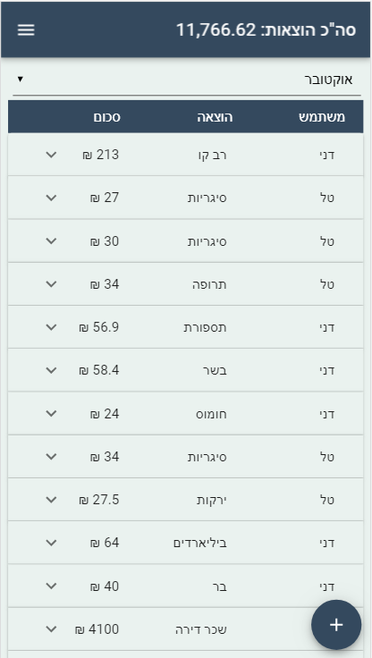
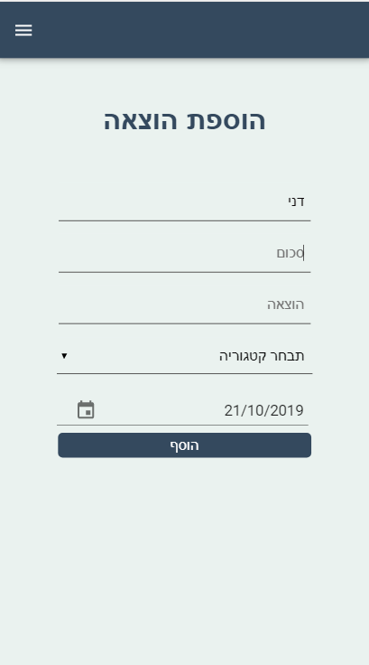
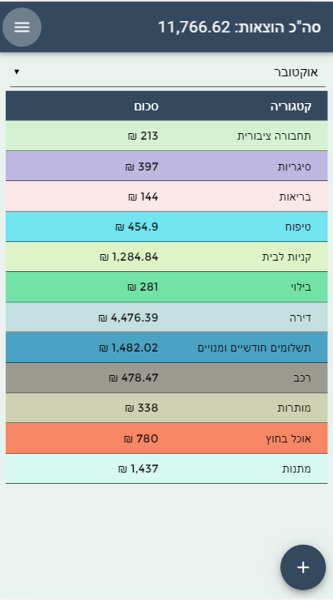
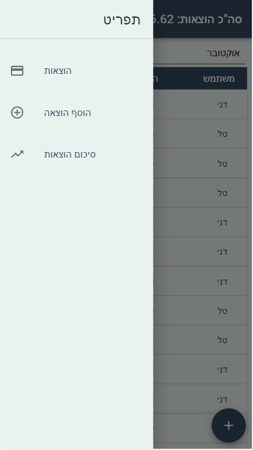

# OurExpenses

OurExpenses is a PWA built with React for mobile. The app allows for couples to track their monthly expenses and view all their expenses by category. (This app has been built for a hebrew speaking couple).

Demo: [https://our-expenses-demo.herokuapp.com](https://our-expenses-demo.herokuapp.com)

## Table Of Contents
- [OurExpenses](#ourexpenses)
  * [Running the project](#running-the-project)
  * [Screenshots](#screenshots)
    + [Expense-List](#expense-list)
    + [Add Expense](#add-expense)
    + [Reports](#reports)
    + [Menu](#menu)
  * [Tech Stack](#tech-stack)
  * [TODO](#todo)

## Running the project
1. Clone the repo.
2. Run `npm install`.
3. Run `npm run build`
4. Run `mongod`
5. Run `npm start`.
6. Navigate to `http://localhost:4000`.

## Screenshots

### Expense List
An overview of all your expenses throughout the current month. You can select another month with the dropdown. Each expense can be clicked on and expanded in order to see extra information such as the date and category of the expense.

### Add Expense
Fill out the inputs and then click *add* to add a new expense.

### Reports
View a report of the totals by category per month.

### Menu
Expanded side menu for the app.

## Techstack
1. React, Material-UI and Axios.
2. Express (Node.js), Mongoose (MongoDB).

## TODO
1. Add a tab view in the reports screen and add an expense report by user.
2. Create real signup/login and database of users for use over many couples.
3. Add error snackbar popup when expense is added.
4. Show message that there is no existing expenses (instead of loader) if api request comes back empty.
5. Change month selector to include selection for year.
6. Add ability to expand each category (in the category report) which will show all the expenses in that category.
7. Compare totals between months and show if specific categories increased or decreased between months.
8. Create a `loadData` function which loads data when the server is started for the demo site and local run.